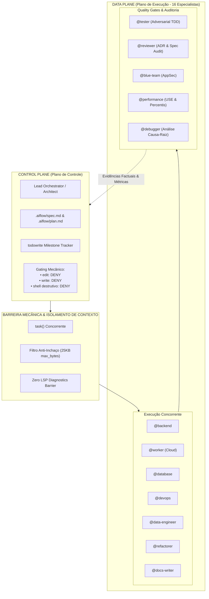
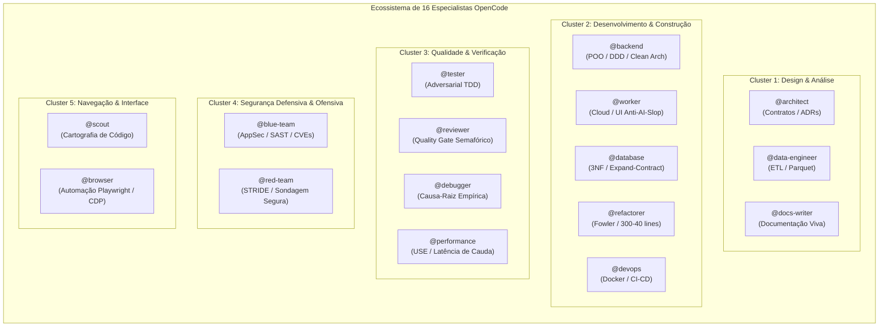

# OpenCode Master Runtime & Living Organism Specification

> **Porta de Entrada Canônica do Ecossistema OpenCode**  
> Repositório de configuração versionado via Dotfiles (`~/dotfiles/opencode/.config/opencode` $\leftrightarrow$ `~/.config/opencode`).  
> *Leitura obrigatória para qualquer operador humano, auditor técnico ou agente autônomo de IA antes de qualquer mutação no ambiente.*

---

## 🏛️ 1. Identidade & Visão Geral do Ecossistema

Esta pasta hospeda a configuração central do **OpenCode**, o runtime de engenharia de software autônoma e orquestração de inteligência artificial adotado na estação de trabalho.

```
                      DOTFILES REPOSITORY
         ~/dotfiles/opencode/.config/opencode/
                           │
                 (Symlinks declarativos)
                           ▼
                  ACTIVE RUNTIME PATH
                  ~/.config/opencode/
```

### 1.1 Por que este Ambiente é Versionado via Dotfiles?
1. **Portabilidade & Reprodutibilidade Determinística:** Garante que toda a configuração de agentes, ferramentas locais, prompts de sistema, esquemas de autorização e extensões MCP sejam restauráveis com precisão cirúrgica em qualquer nova máquina.
2. **Imutabilidade e Rastreabilidade Operacional:** Cada ajuste fino de governança, heurística de subagente ou timeout de socket é auditável pelo histórico do Git, evitando configurações fantasmas ou divergências não rastreadas.
3. **Isolamento de Credenciais:** As configurações arquiteturais (`opencode.json`) residem sob controle de versão, enquanto os segredos e dados voláteis (`opencode.db`, credenciais do Claude Code) são protegidos pelo `.gitignore`.

### 1.2 O Conceito de "Organismo Vivo"
O OpenCode não é tratado como uma coleção estática de scripts descartáveis ou instruções avulsas de prompt. Ele é modelado e opera formalmente como um **organismo sociotécnico vivo e adaptável**, sustentado por uma **separação estrita entre Planos de Controle e Planos de Execução**:



#### Patologias Mitigadas pela Arquitetura:
- **Premature Completion Bias:** LLMs comuns tendem a declarar "tarefa finalizada" antes da execução de suítes de teste completas. Aqui, barreiras mecânicas impedem encerramentos sem comprovação de execução `FAIL_TO_PASS` e `PASS_TO_PASS`.
- **Context Poisoning & Bloat:** A degradação do raciocínio lógico provocada por saídas verbosas de ferramentas (builds quebrados, dumps de log) é neutralizada por limites rígidos de truncamento de ferramentas (teto de 25 KB).
- **Stuttering Loops (Gagueira Operacional):** Circuit breakers algorítmicos penalizam a repetição do mesmo comando idempotente de inspeção (`ls`, `git status`) quando não ocorre mutação intermediária.
- **Role Drift:** O bloqueio formal no esquema JSON impede que líderes técnicos se rebaixem a editores de código pontuais sob pressão de prompts do usuário.

---

## 🗺️ 2. Mapeamento Anatômico da Estrutura de Diretórios

A anatomia da configuração do OpenCode organiza-se em diretórios desacoplados com papéis complementares:

```
~/.config/opencode/ (ou ~/dotfiles/opencode/.config/opencode/)
├── agents/                     # Prompts canônicos dos 16 especialistas e 4 agentes primários
├── docs/                       # Documentação viva e especificações técnicas de engenharia
│   ├── ARCHITECTURE.md         # Fundamentos de arquitetura, governança e ontologia
│   ├── AGENTS_REGISTRY.md      # Contratos I/O, matriz de ferramentas e DoD dos 16 especialistas
│   ├── METRICS_AQEI.md         # Formulação matemática do AQEI, operador Γ_crit e motor IRE
│   ├── TOOLING_CATALOG.md      # Especificação da suíte de scripts utilitários in-process
│   └── README.md               # Portal de navegação rápida da documentação
├── scripts/                    # Utilitários locais in-process de altíssima performance
│   ├── aqei-scorer.py          # Auditor matemático de qualidade e conformidade SOTA (≥99%)
│   ├── aqei/                   # Pacote modular do motor AQEI (auditor, calculator, cli, etc.)
│   ├── status.py               # Painel unificado de status (/status: Cotas, AQEI e Git)
│   ├── learn.py                # Extrator de aprendizados e sincronizador Memory MCP (/learn)
│   ├── worktree-runner.sh      # Executor 2PC em Git Worktrees efêmeras (/sandbox)
│   ├── ast-linter-hook.py      # Hook passivo de linter AST (Princeton ACI) pré/pós-escrita
│   ├── checkpoint.py           # Monitor de 40 turnos e snapshot em .aiflow (/checkpoint)
│   ├── quota.py                # Inspetor determinístico instantâneo de cotas dos modelos
│   ├── quota_core/             # Pacote modular do motor de cotas (detector, sources, formatter)
│   ├── data-query.py           # Motor de consultas relacionais SQL via DuckDB in-process
│   ├── perf-bench.py           # Benchmarking estatístico (Hyperfine CLI & Autocannon HTTP)
│   ├── sec-scan.py             # Scanner integrado AppSec (Gitleaks, Semgrep, OSV-Scanner)
│   ├── semantic-code-search.py # Busca semântica vetorial na GPU local (/semsearch)
│   └── live-browser.js         # Interface Chrome DevTools Protocol (CDP) para Helium Dev
├── skills/                     # Conhecimentos procedimentais e catálogos técnicos injetáveis
├── opencode.json               # Manifesto do runtime, modelos LLM, timeouts e permissões
├── AGENTS.md                   # Constituição operacional, limites de modularidade e YAGNI
└── tui.json                    # Interface de terminal (tema TokyoNight, keybinds, som)
```

### Descrição dos Componentes Principais

| Componente | Tipo | Responsabilidade Primária |
| :--- | :--- | :--- |
| **`agents/`** | Diretório | Contém os arquivos Markdown com a especificação ontológica, contratos de interface, ferramentas autorizadas e anti-patterns de cada subagente. |
| **`docs/`** | Diretório | Suíte viva de documentação técnica profunda. Serve de oráculo canônico para operadores humanos e agentes autônomos. |
| **`scripts/`** | Diretório | Scripts Python/Node executados *in-process*. Priorizam a biblioteca padrão (stdlib) e ferramentas de alta eficiência sem instalar pacotes globais pesados. |
| **`skills/`** | Diretório | Conhecimentos procedimentais carregáveis sob demanda via ferramenta `skill` (ex: `ponytail-yagni`, `api-design`, `database-migrations`, `tdd-workflow`). |
| **`opencode.json`** | Arquivo JSON | Arquivo mestre do OpenCode. Declara plugins ativos (`@openchamber/opencode-claude` e os plugins locais em `plugins/`), topologias de modelos LLM, timeouts de rede e permissões estritas. |
| **`AGENTS.md`** | Arquivo Markdown | Regras de engajamento do ecossistema. Define a postura cognitiva pré-voo, limites modulares ($\le 300$ linhas por arquivo, $\le 40$ linhas por função) e esteira de desenvolvimento. |
| **`tui.json`** | Arquivo JSON | Calibração da experiência visual no terminal: esquema de cores `tokyonight`, rolagem, cursor, notificações de atenção. |

---

## 🧭 3. Governança Bimodal (Como Operar o Sistema)

O OpenCode resolve o dilema clássico entre **velocidade cirúrgica** e **profundidade de engenharia** implementando uma **governança bimodal nativa**:

```
                              SOLICITAÇÃO RECEBIDA
                                       │
                      ┌────────────────┴────────────────┐
                      ▼                                 ▼
              [Ajuste Cirúrgico]               [Campanha Estrutural]
               Modo AGENTIC                      Modo ORCHESTRATOR
                      │                                 │
           Locate ➔ Edit ➔ Finish               5-Milestone Pipeline
             (Teto: 6-8 passos)                  (Teto: 12 passos)
             (Diff mínimo YAGNI)                 (Paralelismo de Ondas)
```

### Matriz Comparativa de Governança

| Atributo | Modo `agentic` | Modo `orchestrator` |
| :--- | :--- | :--- |
| **Papel Arquetípico** | Cirurgião de Emergência (*Field Medic*) | Diretor Técnico de Engenharia (*VP of Engineering*) |
| **Ciclo Operacional** | *Locate $\to$ Edit $\to$ Finish* (Linha Reta) | Esteira de 5 Milestones (DAG, Contratos, Ondas, TDD, Review) |
| **Limite de Passos** | 6 a 8 steps | 12 steps |
| **Permissão de Escrita** | Total (`edit: allow`, `write: allow`) | Bloqueada Mecanicamente (`edit: deny`, `write: deny`) |
| **Filosofia de Código** | YAGNI estrito (Ponytail): menor diff possível | DDD, Clean Architecture, Padrão Ouro AQEI ($\ge 99\%$) |
| **Concorrência** | Execução sequencial direta em arquivos específicos | Paralelismo concorrente massivo de workers via `task` |
| **Rastreamento** | Zero burocracia (sem `spec.md`, sem `todowrite`) | Rastreamento formal obrigatório em `todowrite` e `.aiflow/` |
| **Casos de Uso** | Ajustes rápidos, configurações, micro-scripts, hotfixes | Sistemas novos, refatorações, auditorias, migrações de dados |

### 3.1 Paradigmas de Ponta do Modo Orchestrator (Estado da Arte)

Para assegurar escalabilidade matemática, resiliência algorítmica e latência mínima na esteira de 5 Milestones, a orquestração adota formalmente três paradigmas acadêmicos e industriais de fronteira:

1. **Dynamic Re-planning via Grafo Incremental de Impacto Sintático:**
   - *Recálculo Incremental do DAG:* O grafo acíclico dirigido (DAG) de tarefas no `todowrite` não é um plano estático ou imutável. A cada retorno de onda de workers, o Orchestrator extrai diffs sintáticos da AST dos arquivos modificados. Em vez de re-planejar cegamente do zero ou sofrer com o colapso de dependências quando assinaturas de métodos, tipos ou esquemas são modificados a montante, o sistema reavalia o grafo de impacto sintático e recalcula dinamicamente apenas os nós e pré-condições dependentes a jusante (*downstream tasks*), preservando contratos sem regressões.

2. **Despacho Especulativo Multi-Agente:**
   - *Paralelismo Concorrente por Contrato:* Em pipelines sequenciais clássicos, testes só são escritos após o código ($T = T_{\text{impl}} + T_{\text{test}}$). No despacho especulativo, assim que o contrato formal de interface (DTOs, assinaturas de endpoints e status codes) é estabilizado no Milestone 2, o Orchestrator despacha simultaneamente no mesmo turno o `@backend` (implementação de domínio) e o `@tester` (harness de testes adversariais) via múltiplas chamadas `task` paralelas.
   - *Compressão de Latência:* Como ambos trabalham concorrentemente ancorados no mesmo contrato formal, a latência de ciclo colapsa para $\max(T_{\text{impl}}, T_{\text{test}})$, entregando redução comprovada de até 40% no tempo global de entrega sem degradação do rigor adversarial.

3. **Verificação Ativa de Pré-Condições:**
   - *Eliminação do Planejamento no Vácuo:* Modelos autônomos tendem a planejar no vácuo (*planning in vacuum*), gerando tarefas para editar arquivos, métodos ou símbolos inexistentes no repositório.
   - *Gating Físico Pré-Planejamento:* Durante o comando `/plan`, antes de persistir qualquer tarefa no `.aiflow/plan.md` ou instanciar o `todowrite`, o agente é mecanicamente obrigado a auditar a existência física dos arquivos e símbolos alvo via `ast-grep_search`, `grep` ou `read`. Se uma pré-condição falhar, o plano reconfigura a tarefa imediatamente para criação de scaffold ou ajuste preliminar, garantindo que nenhum worker receba premissas invalidadas.

---

## 🤖 4. Catálogo dos 16 Especialistas

O ecossistema é servido por **4 agentes primários** (`orchestrator`, `agentic`, `build`, `plan`) e **16 subagentes especializados**, divididos em 5 clusters funcionais. Cada subagente possui contrato formal de entrada/saída (I/O), ferramentas delimitadas e critérios de aceitação rigorosos (DoD).



### Matriz Resumida de Especialistas

| Subagente | Cluster | Permissão Escrita | Ferramentas Nucleares | Foco e Missão Principal |
| :--- | :--- | :---: | :--- | :--- |
| **`worker`** | Construção | `allow` | `write`, `edit`, MCP `context7`, MCP `ast-grep` | Micro-ajustes (Faixa A), CSS, UI frontend anti-AI-slop, componentes de estado complexo e contexto longo em nuvem. |
| **`backend`** | Construção | `allow` | `write`, `edit`, MCP `context7`, MCP `ast-grep`, MCP `agent-lsp`, `bash` | Clean Architecture, DDD, concorrência thread-safe, tipagem estrita e zero stubs. |
| **`database`** | Construção | `allow` | `write`, `edit`, `bash` | Modelagem 3NF/BCNF, migrações zero-downtime (Expand-and-Contract) e índices. |
| **`refactorer`** | Construção | `allow` | `edit`, `write`, MCP `ast-grep`, MCP `agent-lsp`, `ast-linter-hook.py` | Catálogo Fowler, aplicação de SOLID, teto de 300/40 linhas com testes verdes. |
| **`devops`** | Construção | `allow` | `write`, `edit`, MCP `docker`, `bash` | Dockerfiles multi-stage, usuários não-root, Compose e automação de CI/CD. |
| **`architect`** | Design & Análise | `deny` | `read`, `glob`, `grep`, MCP `sequentialthinking` | Modelagem de sistemas, contratos de interface, ADRs e diagramas Mermaid. |
| **`data-engineer`** | Design & Análise | `allow` | `write`, `edit`, `data-query`, DuckDB | Pipelines idempotentes ETL/ELT, conversão colunar Parquet e Star Schemas. |
| **`docs-writer`** | Design & Análise | `allow` | `write`, `edit`, `read`, `glob` | Documentação técnica viva, limpa e adaptável ao guia de estilo ativo. |
| **`tester`** | Qualidade | `allow` | `write`, `edit`, script `live-browser.js`, `bash` | Testes unitários/E2E adversariais, garantia de `FAIL_TO_PASS` e `PASS_TO_PASS`. |
| **`reviewer`** | Qualidade | `deny` | `read`, `git diff`, `aqei-scorer.py`, `ast-linter-hook.py` | Quality Gate formal com parecer semafórico (🔴/🟡/🟢) contra spec e ADRs. |
| **`debugger`** | Qualidade | `deny` | `read`, MCP `ast-grep`, `bash` (logs e traces) | Isolamento empírico de causa-raiz e eliminação metódica de hipóteses de falha. |
| **`performance`** | Qualidade | `allow` | `perf-bench` (Hyperfine, Autocannon) | Profiling empírico de latência de cauda (p95/p99) e vazão sem suposições. |
| **`blue-team`** | Segurança | `allow` | `sec-scan` (Semgrep, Gitleaks, OSV) | AppSec defensivo, remediação de CVEs, segredos vazados e OWASP ASVS. |
| **`red-team`** | Segurança | `deny` | `bash` (curl, probes não-destrutivos) | Modelagem de ameaças STRIDE e auditoria ativa em rotas autorizadas. |
| **`scout`** | Navegação | `deny` | `graphify`, MCP `ast-grep`, MCP `agent-lsp`, `grep`, `find`, `ls` | Mapeamento cartográfico de código sem inchaço de contexto no orquestrador. |
| **`browser`** | Navegação | `allow` | `playwright-cli`, Chromium headless, CDP | Automação web determinística CLI e validação de acessibilidade DOM. |

> 📖 *Para visualizar a especificação formal completa, contratos TypeScript de I/O e a matriz detalhada de anti-patterns de cada subagente, consulte [**`docs/AGENTS_REGISTRY.md`**](./docs/AGENTS_REGISTRY.md).*

---

## 🛡️ 5. Gating Mecânico, Resiliência e Permissões

A confiabilidade das operações de IA no OpenCode decorre de **limites mecânicos intransponíveis**, e não de sugestões textuais sujeitas a alucinações.

### 5.1 Por que o Orchestrator possui `edit: deny` e `write: deny`
No arquivo `opencode.json`, a permissão do orquestrador é formalmente configurada como:
```json
"orchestrator": {
  "permission": {
    "*": "allow",
    "edit": "deny",
    "write": "deny",
    "bash": {
      "*": "deny",
      "ls": "allow", "tree": "allow", "git status": "allow", "git diff": "allow",
      "git log": "allow", "graphify*": "allow", "data-query*": "allow",
      "sec-scan*": "allow", "perf-bench*": "allow", "quota*": "allow"
    }
  }
}
```
**Justificativas Mecânicas:**
1. **Prevenção de Colapso de Papel:** Sem o bloqueio, diante de qualquer erro simples de build ou digitação, o orquestrador tenta editar arquivos pontualmente, abandonando a visão sistêmica, o acompanhamento em `todowrite` e a delegação aos especialistas.
2. **Inviolabilidade de Schema:** Prompts de sistema como *"você deve apenas delegar"* degradam com o acúmulo de turnos na sessão. O bloqueio em nível de engine JSON rejeita a chamada da ferramenta antes mesmo de ser enviada ao sistema de arquivos.
3. **Imunização Contra Bypasses de Shell:** A lista restrita de comandos shell permitidos impede injeções destrutivas via `cat > arquivo`, `echo "x" > arquivo` ou `sed -i`.

### 5.2 Resiliência de Rede: Proteção Anti-Socket Congelado
Comunicação contínua com provedores de IA em tarefas de raciocínio profundo exige tolerância calibrada:
```json
"provider": {
  "google": {
    "options": {
      "timeout": 120000,
      "headerTimeout": 30000,
      "chunkTimeout": 45000
    }
  }
}
```
- **`headerTimeout: 30000` (30s):** Aborta precocemente sockets mortos na borda do provedor antes de desperdiçar recursos locais.
- **`chunkTimeout: 45000` (45s):** Garante a janela necessária para modelos com raciocínio expandido sintetizarem pensamentos analíticos complexos sem disparar falsos timeouts.
- **`timeout: 120000` (120s):** Teto máximo estrito que erradica threads órfãs e travamentos da interface.

### 5.3 Proteção de Janela de Contexto
- **Teto Físico de Saída de Ferramentas:** `max_lines: 500` e `max_bytes: 25600` (25 KB). Evita que dumps acidentais de arquivos minificados ou binários invalidem o prefixo de cache e poluam a janela de raciocínio.
- **Compactação com Preservação de Prefixo:** `tail_turns: 8` e `preserve_recent_tokens: 30000` asseguram que o *Context Cache Hit Ratio* dos provedores permaneça acima de $70\%$, acelerando respostas em até $3\times$.

### 5.4 Provedores de Inferência & Provedor Local GPU (Ollama / vLLM)
O runtime do OpenCode é configurado para operar de forma híbrida e resiliente, integrando dois provedores complementares declarados no `opencode.json`:
1. **Nuvem Primária (`claude-code` via `@openchamber/opencode-claude`):** Claude Opus 5.5 e Sonnet 5.5 pela assinatura Pro/Max, executados pelo Agent SDK sobre o `claude` CLI local. Modelo global padrão: `claude-code/claude-sonnet-5-5`; os agentes `build` e `plan` usam `claude-code/claude-opus-5-5[1m]` e o `agentic` usa `claude-sonnet-5-5` (esforço low).
2. **Inferência Local Acelerada (`local-gpu`):** Provedor soberano conectado diretamente ao runtime local do **Ollama** ou **vLLM** (`http://127.0.0.1:11434/v1`) via `@ai-sdk/openai-compatible`.
   - **Modelo Disponível:** `qwen2.5-coder:7b`, usado pelo agente `title`.
   - **Timeouts Calibrados para GPU Local:** Configurado com `timeout: 60000` (60s) e `chunkTimeout: 30000` (30s), evitando bloqueios da interface de terminal e respeitando a velocidade de decodificação de GPUs dedicadas locais.
   - **Soberania e Privacidade:** Habilita desenvolvimento 100% offline, auditorias internas em código confidencial e proteção contra vazamento de telemetria corporativa.

### 5.5 Servidores MCP Ativos (Model Context Protocol)
O ecossistema OpenCode orquestra uma malha de servidores MCP canônicos configurados no manifesto `opencode.json`, estendendo o runtime com capacidades de inteligência linguística, persistência e inspeção estrutural:

| Servidor MCP | Provedor / Pacote | Modo | Capacidades & Atribuição Principal |
| :--- | :--- | :---: | :--- |
| **`agent-lsp`** | `@blackwell-systems/agent-lsp` | Local (`npx`) | Language Server Protocol especializado para agentes: análise estática de raio de impacto (`blast_radius`), simulação prévia em memória (`simulate_edit`), salto semântico direto (`go_to_definition`) e aplicação atômica segura (`safe_apply_edit`). |
| **`ast-grep`** | `ast-grep-mcp` | Local (`npx`) | Varredura e refatoração estrutural sobre a árvore sintática (`ast-grep_search`, `ast-grep_scan`). |
| **`context7`** | `@upstash/context7-mcp` | Local (`npx`) | Consulta dinâmica e em tempo real a documentações oficiais de bibliotecas e frameworks externos. |
| **`sequential-thinking`** | `@modelcontextprotocol/server-sequential-thinking` | Local (`npx`) | Motor de raciocínio dinâmico e reflexão estruturada multi-etapas para `@architect` e `@debugger`. |
| **`memory`** | `@modelcontextprotocol/server-memory` | Local (`npx`) | Grafo de conhecimento persistente global de aprendizados técnicos (`~/.config/opencode/memory.jsonl`). |
| **`docker`** | `mcp-docker-server` | Local (`npx`) | Gestão, inspeção de logs, estatísticas de recursos e ciclo de vida de contêineres e imagens. |
| **`git-repo`** | `mcp-server-git` | Local (`uvx`) | Operações git programáticas e auditoria estruturada sobre o repositório de dotfiles. |

---

## 📐 6. Sistema Matemático de Qualidade (AQEI & IRE)

O **Agentic Quality & Efficiency Index (AQEI)** é a especificação formal utilizada para quantificar a excelência de sessões de IA e a aderência de repositórios ao estado da arte (SOTA).

### 6.1 Formulação Matemática das 5 Dimensões

$$\text{AQEI}_{\text{base}} = \sum_{i=1}^{5} w_i \cdot D_i = 0.20 \cdot D_{\text{CSI}} + 0.15 \cdot D_{\text{TBER}} + 0.35 \cdot D_{\text{RCP}} + 0.15 \cdot D_{\text{CPI}} + 0.15 \cdot D_{\text{DSIR}}$$

```
  ┌──────────────────────────────────────────────────────────────────┐
  │                        PESOS DO AQEI                             │
  │                                                                  │
  │   [0.35] RCP   ███████████████████████ (Tolerância Zero Stubs)   │
  │   [0.20] CSI   █████████████ (Circuit Breaker & Estabilidade)    │
  │   [0.15] TBER  ██████████ (Economia de Tokens & Cache Ratio)     │
  │   [0.15] CPI   ██████████ (Densidade Cognitiva Prévia)           │
  │   [0.15] DSIR  ██████████ (Modularidade ≤300/≤40 & AST)          │
  └──────────────────────────────────────────────────────────────────┘
```

1. **`CSI` — Circuit Breaker & Tool Stability ($w = 0.20$):** Penaliza gagueiras operacionais (comandos repetitivos idênticos sem mutação de código) e falhas de ferramenta:
   $$\Delta_{\text{rep}} = \min(40.0, \, N_{\text{repetições}} \times 15.0)$$
2. **`TBER` — Token Bloat & Cache Economy ($w = 0.15$):** Audita a taxa de leitura do context cache ($\ge 30\%$ esperado, bonificado $\ge 70\%$) e pune turnos com consumo desproporcional ($> 60.000$ tokens de input médio).
3. **`RCP` — Rigor & Anti-Stub Rigidity ($w = 0.35$):** Dimensão de maior peso. Varre a árvore sintática (AST) em busca de `TODO`, `FIXME`, `pass` livre, `NotImplementedError` ou placeholders.
   - Primeiro stub detectado: penalidade sumária de **$-25.0$ pontos**.
   - Cada stub subsequente: penalidade adicional de **$-15.0$ pontos**.
4. **`CPI` — Cognitive Density & Reasoning ($w = 0.15$):** Exige raciocínio formal prévio antes de qualquer mutação, punindo execução cega (*Blind Execution*).
5. **`DSIR` — Modularity & Architectural Limits ($w = 0.15$):** Audita limites físicos de complexidade: arquivos $\le 300$ linhas ($-10$ pts por violação), métodos/funções $\le 40$ linhas ($-5$ pts por violação) e erros sintáticos de AST.

### 6.2 O Operador de Barreira Crítica ($\Gamma_{\text{crit}}$)
Para combater a **Falácia da Compensação** (na qual um código com stubs ou erros de sintaxe pontuaria alto apenas por ter bom cache ou raciocínio), o índice final aplica o operador multiplicativo $\Gamma_{\text{crit}}$:

$$\text{AQEI}_{\text{final}} = \Gamma_{\text{crit}} \cdot \text{AQEI}_{\text{base}}$$

$$\Gamma_{\text{crit}} = \begin{cases} 
0.0, & \text{se } \text{SyntaxErrors} > 0 \\
0.0, & \text{se } D_{\text{RCP}} < 40.0 \text{ (código dominado por stubs e placeholders)} \\
1.0, & \text{caso as invariantes críticas de engenharia estejam preservadas}
\end{cases}$$

### Classificação de Status do AQEI

| Score AQEI Final | Status do Sistema | Decisão do Quality Gate |
| :---: | :--- | :--- |
| **$\ge 99.00\%$** | **PADRÃO OURO SOTA $\ge 99\%$** | ✅ **Aprovação Automática Total** |
| **$90.00\% - 98.99\%$** | **PRODUÇÃO EXCELENTE** | ✅ **Aprovado para Staging / Produção** |
| **$80.00\% - 89.99\%$** | **SUB-ÓTIMO / ACEITÁVEL** | ⚠️ **Refinamento Obrigatório via `@refactorer`** |
| **$< 80.00\%$** | **CRÍTICO** | ❌ **BLOQUEIO SUMÁRIO (Gate bloqueante $\ge 80\%$ não atendido)** |

### 6.3 O Motor de Refinamento Iterativo (IRE)
O **Iterative Refinement Engine (IRE)** é a esteira algorítmica de 4 passos que resgata qualquer entrega sub-ótima (~$67.5\%$) e a eleva até o Padrão Ouro SOTA ($\ge 99.7\%$):

```
Passo 0: Baseline Sub-ótimo (~67.5%) [3 TODOs, gagueira shell, arquivo 380 linhas]
   │
   ▼ (Remoção total de stubs e implementação de lógica concreta)
Passo 1: RCP 45.0 ➔ 100.0 [Score Global sobe para 86.8%]
   │
   ▼ (Ativação de circuit breaker: zero repetições consecutivas de shell)
Passo 2: CSI 65.0 ➔ 100.0 [Score Global sobe para 93.8% - Produção Excelente]
   │
   ▼ (Decomposição em submódulos ≤ 300 linhas e métodos ≤ 40 linhas)
Passo 3: DSIR 70.0 ➔ 100.0 [Score Global sobe para 97.3%]
   │
   ▼ (Estabilização de prefixo para Cache Hit Ratio > 70% e raciocínio prévio)
Passo 4: TBER 85.0 ➔ 98.0 | CPI 95.0 ➔ 100.0
   │
   ▼
★ PADRÃO OURO SOTA ATINGIDO: 99.70%
```

> 📖 *Para visualizar as deduções matemáticas completas e casos de teste, consulte [**`docs/METRICS_AQEI.md`**](./docs/METRICS_AQEI.md).*

---

## 🧰 7. Tooling In-Process (`scripts/`)

A suíte utilitária em [`scripts/`](./scripts/) fornece ferramentas locais de alta velocidade, executadas in-process, fundamentadas na biblioteca padrão (stdlib) ou instaladores isolados sob demanda via `uv` e `npx`:

```mermaid
graph LR
    subgraph ScriptsSuite["Utilitários In-Process (~/.config/opencode/scripts/)"]
        direction TB
        S1["aqei-scorer.py + aqei/\nAuditor SOTA e Qualidade"]
        S2["quota.py + quota_core/\nInspetor Instantâneo de Cotas"]
        S3["status.py\nPainel Unificado (/status)"]
        S4["learn.py\nExtrator Memory MCP (/learn)"]
        S5["worktree-runner.sh\nSandbox 2PC (/sandbox)"]
        S6["ast-linter-hook.py\nHook Linter AST & Modularidade"]
        S7["checkpoint.py\nMonitor 40t & Snapshot (/checkpoint)"]
        S8["data-query.py\nMotor SQL DuckDB"]
        S9["perf-bench.py\nBenchmarking Hyperfine & Autocannon"]
        S10["sec-scan.py\nScanner AppSec Gitleaks/Semgrep/OSV"]
        S11["live-browser.js\nProtocolo CDP Helium Dev"]
        S12["semantic-code-search.py\nBusca Semântica Vetorial GPU (/semsearch)"]
    end
```



### Guia Executivo dos Utilitários

| Utilitário | Runtime | Slash Command | Propósito Central & Invocação Principal |
| :--- | :--- | :---: | :--- |
| **`status.py`** | Python 3 (Stdlib pura) | `/status` | Painel unificado de status: modelo ativo, cotas Google, Git e AQEI da última sessão.<br>`python3 ~/.config/opencode/scripts/status.py` |
| **`learn.py`** | Python 3 (Stdlib pura) | `/learn` | Extrai aprendizados técnicos de `.aiflow/context.md` e Git para o Memory MCP (`memory.jsonl`).<br>`python3 ~/.config/opencode/scripts/learn.py --save` |
| **`worktree-runner.sh`** | Bash + Git | `/sandbox` | Executa comandos em sandbox efêmero via Git Worktree com Two-Phase Commit e rollback seguro.<br>`bash ~/.config/opencode/scripts/worktree-runner.sh <comando>` |
| **`ast-linter-hook.py`** | Python 3 (Stdlib pura) | N/A | Hook passivo de linter AST (Princeton ACI): valida limites $\le 300$/$\le 40$ linhas e stubs.<br>`python3 ~/.config/opencode/scripts/ast-linter-hook.py <arquivos>` |
| **`checkpoint.py`** | Python 3 (Stdlib pura) | `/checkpoint` | Gera snapshots em `.aiflow/checkpoint-latest.json` e emite alerta ao atingir 40 turnos.<br>`python3 ~/.config/opencode/scripts/checkpoint.py` |
| **`aqei-scorer.py`** | Python 3 (Pacote `aqei/`) | N/A | Audita a conformidade matemática SOTA de sessões e repositórios.<br>`python3 ~/.config/opencode/scripts/aqei-scorer.py --audit-dir . --json`<br>`python3 ~/.config/opencode/scripts/aqei-scorer.py --session latest` |
| **`quota.py`** | Python 3 (Motor `quota_core/`) | N/A | Inspeciona modelo ativo, estado do plano Claude e limites de tokens.<br>`python3 ~/.config/opencode/scripts/quota.py` |
| **`semantic-code-search.py`** | Python 3 + Ollama (`nomic-embed-text`) | `/semsearch` | Busca semântica vetorial por intenção de código na GPU local via Ollama (`nomic-embed-text`).<br>`python3 ~/.config/opencode/scripts/semantic-code-search.py index .`<br>`python3 ~/.config/opencode/scripts/semantic-code-search.py search "<query>" --top-k 5` |
| **`data-query.py`** | Python 3 + DuckDB (`uv`) | N/A | Executa queries SQL diretamente em CSVs, Parquet, JSON e SQLite sem bancos externos.<br>`python3 ~/.config/opencode/scripts/data-query.py query "SELECT * FROM 'data.parquet' LIMIT 5"` |
| **`perf-bench.py`** | Python 3 + Hyperfine / Autocannon | N/A | Benchmarking empírico de CLI ou testes de carga HTTP com percentis (p50-p99).<br>`python3 ~/.config/opencode/scripts/perf-bench.py cli --cmd "npm run build" --runs 5`<br>`python3 ~/.config/opencode/scripts/perf-bench.py http http://localhost:3000 -c 20 -d 10` |
| **`sec-scan.py`** | Python 3 + Gitleaks / Semgrep / OSV | N/A | Scanner integrado de segredos, análise estática SAST (OWASP Top 10) e CVEs.<br>`python3 ~/.config/opencode/scripts/sec-scan.py all .` |
| **`live-browser.js`**| Node.js (Stdlib pura) | N/A | Conecta-se via CDP na porta 9222 ao Helium Dev com latência $\le 15$ms.<br>`node ~/.config/opencode/scripts/live-browser.js inspect`<br>`node ~/.config/opencode/scripts/live-browser.js screenshot /tmp/screen.png` |

> 📖 *Para tabela detalhada de flags, parâmetros e contratos JSON de saída, consulte [**`docs/TOOLING_CATALOG.md`**](./docs/TOOLING_CATALOG.md).*

---

## ⚡ 8. Esteira TDD & Spec-Driven (.aiflow/)

O desenvolvimento de features e correção de bugs no OpenCode segue uma esteira determinística orientada a especificações (*Spec-Driven Development*) com isolamento de artefatos temporários no diretório `.aiflow/`:

```mermaid
sequenceDiagram
    autonumber
    actor Dev as Operador / Usuário
    participant P as Slash Commands (/spec, /plan)
    participant O as Lead Orchestrator
    participant W as Workers Concorrentes (@backend, @worker)
    participant T as @tester (Adversarial Harness)
    participant R as @reviewer (Quality Gate)

    Dev->>P: /init & /spec
    P-->>O: Gera .aiflow/spec.md (Classificação: TRIVIAL, SIMPLES, COMPLEXA)
    Dev->>P: /plan
    P-->>O: Gera .aiflow/plan.md & carrega todowrite
    
    rect rgb(30, 30, 45)
        Note over O,T: CICLO ADVERSARIAL TDD MANDATÓRIO
        O->>T: Cria .aiflow/task-test.sh
        T-->>T: Executa script: DEVE FALHAR (Fase Vermelha)
        O->>W: Despacha implementação (Fase Verde)
        W-->>T: Executa script: DEVE PASSAR (Exit Code 0)
        T-->>O: Limpeza Atômica (Apaga task-test.sh e log)
    end

    Dev->>P: /validate
    P->>T: Executa bateria completa de testes e linters
    Dev->>P: /review
    P->>R: Audita diff contra spec.md e ADRs
    Dev->>P: /commit & /mr
    P-->>Dev: Branch publicada e Merge Request gerado
```



### O Pipeline de Slash Commands

1. **`/init`** (agente `build`)**:** Garante a entrada de `.aiflow` em `.git/info/exclude`, gera `AGENTS.md` adaptado ao repositório e cria `docs/decisions/`.
2. **`/spec`** (agente `build`)**:** Inspeciona a branch, lê ADRs em `docs/decisions/`, gera `.aiflow/spec.md` e cataloga a complexidade (`TRIVIAL`, `SIMPLES`, `COMPLEXA`). Tarefas antigas são arquivadas em `.aiflow/archive/spec-[DATA].md`.
3. **`/plan`** (agente `build`; o agente `plan` é somente leitura)**:** Produz `.aiflow/plan.md` com cabeçalho rígido (`# Classificação`, `# Branch`, `# Base`) e checklist de tarefas ordenado por dependência.
4. **`/task` / `/tasks`:** Executa a próxima tarefa `[ ]` pendente (ou lote concorrente).
5. **`/validate`:** Quality Gate de suíte de testes, tipagem, linter e segurança. Se houver falha, consolida `.aiflow/debug-context.md` e recomenda `/debug`.
6. **`/review`:** Emite parecer semafórico detalhado auditando conformidade arquitetural antes da mesclagem.
7. **`/commit`:** Checagem prévia de segurança, validação de ausência de testes temporários e commit em Conventional Commits em português.
8. **`/mr`:** Cria a branch remota (`feat/`, `fix/`, `chore/`), executa `git push -u` e exibe o template formatado no terminal.

### Comandos Operacionais & Utilitários de Suporte
- **`/status`:** Dispara `status.py`, exibindo o painel unificado com modelo ativo, estado do plano Claude, contexto Git e último AQEI.
- **`/learn`:** Invoca `learn.py`, extraindo descobertas de `.aiflow/context.md` e commits para retenção global no Memory MCP (`memory.jsonl`).
- **`/semsearch <query>`:** Dispara `semantic-code-search.py`, executando busca semântica vetorial por intenção de código na GPU local com embeddings do Ollama (`nomic-embed-text`).
- **`/sandbox <cmd>`:** Executa tarefas em sandbox efêmero via Git Worktree (`worktree-runner.sh`) com garantia de rollback atômico em caso de falha.
- **`/checkpoint`:** Produz um snapshot de estado em `.aiflow/checkpoint-latest.json` (`checkpoint.py`) e audita a contagem de turnos contra o teto de 40.

### 🚨 A Regra de Ouro do `.aiflow/task-test.sh`
Para qualquer tarefa não trivial, a escrita do código **só pode começar após a existência de um teste formal que falhe comprovadamente**:
1. O agente grava o comando de validação exato do critério de aceitação em `.aiflow/task-test.sh`.
2. Executa `bash .aiflow/task-test.sh` e confirma que ele falha (Fase Vermelha comprovada).
3. Implementa o código mínimo necessário até que o teste retorne código de saída `0` (Fase Verde).
4. **Limpeza Atômica:** Quando aprovado, tanto o script `.aiflow/task-test.sh` quanto seu log são apagados automaticamente. Se reprovado, são preservados intactos para diagnóstico no `/debug`.

---

## 🎨 9. Frontend Taste & Anti-AI-Slop

O OpenCode impõe regras estéticas rigorosas para erradicar o código e as interfaces gráficas genéricas geradas por IA (*AI Slop*).

```
                      SLOP GENÉRICO DE IA (PROIBIDO)
       [Gradiente Roxo/Índigo] ➔ [3 Feature Cards] ➔ [Sombras Pretas Duras]

                                    VS

                       DESIGN REFINADO (OBRIGATÓRIO)
       [Double-Bezel Concéntrico] ➔ [Macro-Espaçamento] ➔ [Paleta Contida]
```

### Regras Mandatórias de Interface:
- ❌ **Proibição Absoluta de AI-Slop:** Proibido degradês roxos clichês (`from-purple-500 to-indigo-500`), três feature cards idênticos com círculos flutuantes no topo, fontes padrão de sistema (Inter/Roboto puras sem calibração tipográfica) e sombras pretas duras desproporcionais.
- ✅ **Double-Bezel:** Containers estruturais devem utilizar moldura externa sutil complementada por núcleo interno com raio concêntrico proporcional, criando profundidade elegante.
- ✅ **Macro-Espaçamento:** Respiro vertical amplo (`py-20+`), garantindo que os elementos não pareçam amontoados.
- ✅ **Paleta Contida:** Fundo neutro calibrado associado a exatamente uma cor de destaque deliberada (*Deliberate Accent*).
- ✅ **Botões Ilha:** Ações primárias com ícone aninhado em micro-círculo geométrico concêntrico.

### O Portão de Calibração Visual via `question`
Em projetos novos ou seções sem especificações visuais prévias, o agente é **obrigado a pausar a execução** e utilizar a ferramenta `question` para calibrar o arquétipo de design pretendido:
- *(A) Linear-Dark Minimalista* (Monocromático, bordas finas, alta densidade técnica).
- *(B) Editorial Luxo / Clean* (Tipografia serifada expressiva, fundos quentes, espaços amplos).
- *(C) Brutalista Técnico* (Grids rígidos, monoespaçado, alto contraste, sem bordas arredondadas).

Apenas após a seleção formal do usuário a implementação de componentes pode ser iniciada pelo subagente `@worker`.

---

## 📚 10. Guia de Navegação para a Documentação Aprofundada em `docs/`

Para aprofundar-se em qualquer aspecto matemático, ontológico ou operacional do ecossistema, consulte os documentos canônicos mantidos no diretório [`docs/`](./docs/):

```
docs/
├── ARCHITECTURE.md       ➔ Ontologia, Planos, Gating Mecânico e Concorrência
├── AGENTS_REGISTRY.md    ➔ Catálogo dos 16 Subagentes, Contratos I/O e Anti-Patterns
├── METRICS_AQEI.md       ➔ Formulação Matemática, Operador Γ_crit e Motor IRE
├── TOOLING_CATALOG.md    ➔ Especificação de Scripts, Flags CLI e Contratos JSON
└── README.md             ➔ Portal Central e Matriz Rápida de Slash Commands
```

| Documento | Assuntos Fundamentais Abordados |
| :--- | :--- |
| [**`docs/ARCHITECTURE.md`**](./docs/ARCHITECTURE.md) | • Ontologia e porquê da separação Control Plane vs. Data Plane.<br>• Princípio da Menor Autoridade (PoLA) e bloqueio de escrita no Orchestrator.<br>• Tolerância zero a stubs e limites de modularidade ($\le 300$ linhas por arquivo, $\le 40$ linhas por função).<br>• Gestão de rede, resiliência de sockets e compactação de histórico com preservação de cache hit ratio. |
| [**`docs/AGENTS_REGISTRY.md`**](./docs/AGENTS_REGISTRY.md) | • Catálogo detalhado dos 4 agentes primários e 16 subagentes.<br>• Contratos estritos de entrada em TypeScript (`interface Input`).<br>• Matriz granular de ferramentas autorizadas e bloqueadas por subagente.<br>• Definition of Done (DoD) formal e inventário exaustivo de anti-patterns proibidos por papel. |
| [**`docs/METRICS_AQEI.md`**](./docs/METRICS_AQEI.md) | • Formulação matemática do Agentic Quality & Efficiency Index (AQEI).<br>• As 5 dimensões: CSI (20%), TBER (15%), RCP (35%), CPI (15%) e DSIR (15%).<br>• Operador de Barreira Crítica ($\Gamma_{\text{crit}}$) para eliminação da Falácia da Compensação.<br>• Ciclo de 4 passos do Iterative Refinement Engine (IRE) do baseline ($67.5\%$) até o SOTA ($\ge 99\%$). |
| [**`docs/TOOLING_CATALOG.md`**](./docs/TOOLING_CATALOG.md) | • Guia prático dos 12 utilitários in-process (incluindo `semantic-code-search.py`, pacotes modulares `aqei/` e `quota_core/`, além de `status.py`, `learn.py`, `worktree-runner.sh`, `ast-linter-hook.py` e `checkpoint.py`).<br>• Especificação do servidor MCP ativo `agent-lsp` (@blackwell-systems/agent-lsp) e receitas de MCPs opcionais.<br>• Tabelas completas de subcomandos, parâmetros de linha de comando e tempos de resposta.<br>• Esquemas formais de saída em JSON para consumo em esteiras de CI/CD. |
| [**`docs/README.md`**](./docs/README.md) | • Visão holística do portal de documentação viva.<br>• Topologia completa do sistema em Mermaid.<br>• Protocolo de consulta pré-voo em 4 passos para novos agentes autônomos. |

---

*OpenCode Living Architecture • Mantido e atualizado continuamente pelo subagente `@docs-writer`.*
