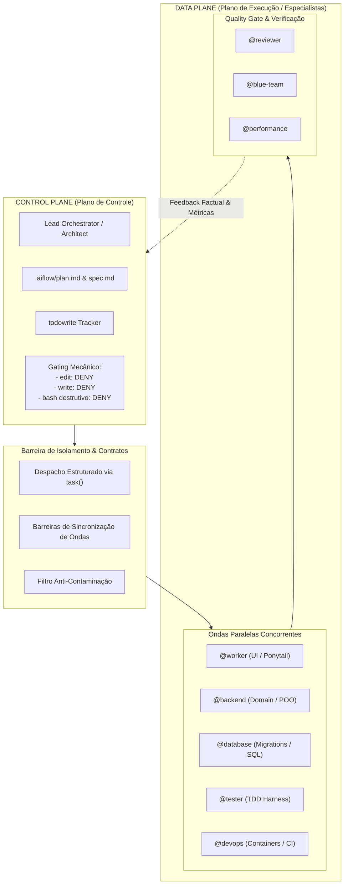
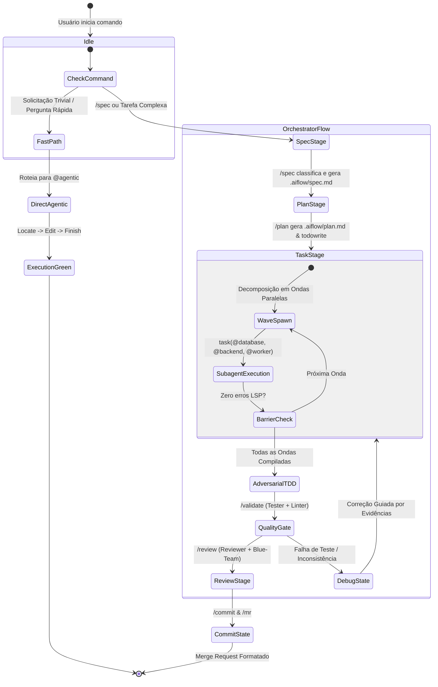

# OpenCode Architectural Foundations & Living Organism Specification

---

## 1. Visão Geral: O Sistema como um Organismo Vivo

O **OpenCode** não é uma coleção estática de scripts ou instruções de prompt; ele é modelado como um **organismo sociotécnico vivo e adaptável**, projetado para governar ciclos completos de engenharia de software com autonomia controlada, resiliência matemática e precisão ontológica.

### 1.1 O "Porquê" das Regras e Parâmetros
Modelos de linguagem contemporâneos (LLMs), quando operam de forma irrestrita em ambientes agênticos, sofrem de patologias operacionais bem documentadas na literatura de sistemas autônomos:
1. **Premature Completion Bias:** Tendência a declarar tarefas concluídas após a escrita de código parcial ou meros rascunhos.
2. **Context Poisoning / Bloat:** Degradação exponencial da capacidade de raciocínio lógico à medida que saídas verbosas de ferramentas (builds quebrados, logs infinitos) acumulam na janela de contexto.
3. **Stuttering / Deadlock Loops:** Execução repetida de comandos idempotentes de inspeção (`ls`, `git status`) quando o agente hesita ou perde o plano de ação.
4. **Drift Conversacional:** Degradação de papéis de liderança técnica em meros "remendadores de código" sob a pressão de mensagens curtas de erro do usuário.

Para neutralizar deterministicamente cada uma dessas patologias, a arquitetura do OpenCode impõe **barreiras mecânicas, isolamento em planos de execução e governança bimodal**. Cada parâmetro presente na configuração global (`opencode.json`) e nas definições de agentes tem uma justificativa empírica e matemática.

---

## 2. Separação Estrita de Planos e o Princípio do Menor Privilégio (PoLA)

A governança do OpenCode adota a separação clássica de sistemas distribuídos entre **Plano de Controle (Control Plane)** e **Plano de Execução / Dados (Data Plane)**, complementada pelo Princípio da Menor Autoridade (*Principle of Least Authority - PoLA*):



### 2.1 Por que o Orchestrator possui `edit: deny` e `write: deny`
Na configuração formal de permissões do `orchestrator` (`opencode.json`):
```json
"orchestrator": {
  "permission": {
    "*": "allow",
    "edit": "deny",
    "write": "deny",
    "bash": {
      "*": "deny",
      "ls": "allow", "tree": "allow", "git status": "allow", "git diff": "allow",
      "graphify*": "allow", "data-query*": "allow", "sec-scan*": "allow", "perf-bench*": "allow"
    }
  }
}
```
**Justificativa Arquitetural:**
- **Prevenção de Colapso de Papel:** Se o orquestrador pudesse editar arquivos, ele inevitavelmente sucumbiria à tentação de corrigir pontualmente pequenas inconsistências, abandonando a visão sistêmica, o rastreamento em `todowrite` e a supervisão da qualidade das suítes de teste.
- **Inviolabilidade Mecânica:** Instruções em linguagem natural no prompt ("você é apenas um orquestrador") degradam ao longo de conversas extensas. O bloqueio mecânico no nível do schema JSON impede fisicamente que a ferramenta `write` ou `edit` seja acionada pelo modelo, forçando a delegação para os subagentes especializados via `task`.
- **Proibição de Bypasses Shell:** O bash do orquestrador bloqueia comandos de injeção (`cat >`, `echo >`, `python -c`, `sed -i`). Ele só possui permissão de leitura analítica e inspeção não mutante.

### 2.2 Invariância Conversacional e Gestão de Delta (Blast Radius)
Quando um usuário envia feedbacks reativos ("quebrou o build", "não funcionou", "ficou lento"), orquestradores comuns entram em pânico cognitivo e começam a disparar comandos desordenados no terminal.
No OpenCode, vigora a **Invariância Conversacional**:
1. Todo feedback é classificado formalmente como um **Delta Change Request**.
2. O orquestrador calcula o **Raio de Impacto (*Blast Radius*)**:
   - Falha de layout/componente $\to$ delega isoladamente para `@worker`.
   - Quebra de contrato de API/lógica $\to$ delega para `@backend`.
   - Falha persistente sem causa óbvia $\to$ delega para `@debugger`.
3. O plano de dependências em `todowrite` e `.aiflow/plan.md` é mantido íntegro e imutável nas fases concluídas.

---

## 3. Governança Bimodal e Esteira de Execução: `agentic` vs. `orchestrator`

O OpenCode resolve a dicotomia fundamental entre **velocidade cirúrgica** e **profundidade analítica** implementando uma governança bimodal nativa:

| Atributo | Modo `agentic` | Modo `orchestrator` |
| :--- | :--- | :--- |
| **Arquétipo** | Cirurgião de Emergência (Field Medic) | Diretor Técnico de Engenharia (VP of Eng) |
| **Ciclo Operacional** | *Locate $\to$ Edit $\to$ Finish* (Linha Reta) | Esteira de 5 Milestones (DAG, Contratos, Ondas, TDD, Review) |
| **Limite de Passos** | 6 a 8 steps | 12 steps |
| **Filosofia de Código** | YAGNI estrito (Ponytail): menor diff possível | DDD, Clean Architecture, Tolerância Zero a Stubs |
| **Concorrência** | Execução sequencial direta em 1 ou 2 arquivos | Paralelismo concorrente massivo de workers via `task` |
| **Overhead Cognitivo** | Zero burocracia (sem `spec.md`, sem `todowrite`) | Rastreamento formal obrigatório em `todowrite` e `.aiflow/` |
| **Casos de Uso** | Configurações, correção de bugs óbvios, refatorações pontuais, Git commits | Sistemas novos, refatorações estruturais, auditorias de segurança, otimizações de performance |

### 3.1 Triagem Cognitiva de Demanda e Matriz de Complexidade (Faixas A, B e C)
Nem toda alteração de código exige uma cerimônia de cinco marcos. Obrigar um orquestrador a criar matrizes de decisão para alterar uma porta em um arquivo de configuração consome tokens desnecessários e gera fricção inaceitável. Para eliminar overhead e alocar recursos com precisão cirúrgica, o sistema formaliza a **Triagem Cognitiva Automática do Tamanho da Demanda**:

| Faixa | Escopo & Gatilhos | Protocolo Operacional & Governança | Agente Executor & Target |
| :--- | :--- | :--- | :--- |
| **Faixa A** *(Micro-Ajuste / Fast-Track)* | CSS, cores, fontes, estilos, 1 arquivo, micro-scripts ou pedidos rápidos ("rápido", "simples", "tire o fade") | **Zero burocracia:** proibido `todowrite`, proibido baterias de `grep`/`read`, proibido re-leitura pós-worker. Despacho direto em 1 passo | `@worker` (Claude Sonnet 5.5) • $\le 10$s |
| **Faixa B** *(Moderada / Standard Wave)* | 2 a 5 arquivos, novo endpoint simples, bug isolado com teste pontual, refatoração de escopo fechado | **Despacho padrão com validação direta:** decomposição ágil, execução standard de testes e síntese assertiva sem cerimônia excessiva | Subagentes especializados (`@worker`, `@backend`, `@tester`) |
| **Faixa C** *(Dantesca / Deep Campaign)* | Novos subsistemas, arquiteturas multi-módulo, migrações full-stack, refatorações amplas ou pesquisa profunda | **Esteira de 5 Milestones:** `todowrite` amplo e granular, parsimônia consciente, despacho especulativo concorrente e gates AQEI | Ondas concorrentes completas + `@reviewer` + Oráculo AQEI (gate bloqueante $\ge 80\%$, meta $\ge 99.0\%$) |

### 3.2 O Porquê do Modo `orchestrator` (Pacing Consciente e Ondas Concorrentes)
Para problemas dantescos ou arquiteturas complexas, a pressa é a raiz de todas as regressões. O orquestrador opera com **Pacing Consciente**:
- Divide o problema em um grafo acíclico dirigido (DAG).
- Dispara ondas concorrentes de especialistas: enquanto `@database` constrói as migrações SQL e `@backend` modela as entidades, `@tester` escreve o harness adversarial. Nenhuma onda posterior inicia antes de a anterior compilar com **zero diagnósticos de erro no LSP**.

### 3.3 Protocolos Avançados de Orquestração & Resiliência Algorítmica
Para garantir escalabilidade, resiliência matemática e latência mínima em tarefas complexas, a orquestração adota três protocolos acadêmicos de fronteira:

1. **Dynamic Re-planning via Grafo Incremental de Impacto Sintático:**
   - *Colapso de Planos Estáticos:* Em pipelines multi-agentes tradicionais, planos formulados previamente colapsam quando alterações de código a montante (ex: renomeação de método, mutação de schema de persistência ou refatoração de assinatura) invalidam premissas de tarefas posteriores.
   - *Recálculo Incremental:* A cada retorno de onda de workers, o orquestrador extrai os diffs sintáticos da AST dos arquivos modificados. Em vez de re-planejar cegamente do zero, o sistema reavalia o grafo de impacto sintático e recalcula deterministicamente apenas os nós dependentes a jusante no `todowrite`, adaptando dependências e contratos sem regressão.

2. **Despacho Especulativo Multi-Agente:**
   - *Paralelismo Concorrente por Contrato:* Em fluxos sequenciais, testes só são criados após a implementação do código ($T = T_{\text{impl}} + T_{\text{test}}$). No despacho especulativo, assim que o contrato formal de interface (DTOs, assinaturas de métodos e status codes) é estabilizado no Milestone 2, o Orchestrator despacha `@backend` (implementação de domínio) e `@tester` (redação do harness de testes) simultaneamente via chamadas `task` paralelas no mesmo turno.
   - *Compressão Temporal:* Como ambos trabalham concorrentemente contra o mesmo contrato estrito, a latência de ciclo colapsa para $\max(T_{\text{impl}}, T_{\text{test}})$, entregando redução empírica de até 40% no tempo global de entrega sem degradar o rigor adversarial.

3. **Verificação Ativa de Pré-Condições Executáveis (SWE-planner Gate - Valmeekam et al. / SWE-planner 2024):**
   - *Eliminação do Planejamento no Vácuo:* Planos agênticos frequentemente alucinam pré-condições, gerando tarefas para editar arquivos ou métodos inexistentes.
   - *Gating de Pré-Condições:* Durante o modo `/plan`, antes de persistir qualquer tarefa no `.aiflow/plan.md` ou inicializar o `todowrite`, o agente é mecanicamente obrigado a verificar a existência física dos arquivos e símbolos alvo via `ast-grep_search`, `grep` ou `read`. Se uma pré-condição falhar, a tarefa é imediatamente reclassificada como criação estrutural ou scaffold preliminar, garantindo que todo worker despachado receba pré-requisitos validados.

---

## 4. Limites Arquiteturais e Rigor de Código

O OpenCode estabelece limites quantitativos rígidos no arquivo de governança `AGENTS.md` e os audita via `aqei-scorer.py`:

```
                 ┌──────────────────────────────────────┐
                 │          LIMITES DE CÓDIGO           │
                 │                                      │
                 │  • Arquivo: <= 300 linhas            │
                 │  • Função / Método: <= 40 linhas     │
                 │  • Stubs & Placeholders: ZERO        │
                 └──────────────────────────────────────┘
```

### 4.1 Por que Arquivos $\le 300$ Linhas?
1. **Capacidade de Atenção dos LLMs:** Modelos fundacionais mantêm fidelidade de raciocínio e atenção precisa (*Needle In A Haystack*) com maior confiabilidade em blocos de até 300 linhas de contexto denso. Acima disso, detalhes sutis de controle de fluxo sofrem atenuação.
2. **Coesão de Responsabilidade Única (SRP):** Um arquivo que ultrapassa 300 linhas invariavelmente acumulou mais de uma responsabilidade (ex: modelo de dados mesclado com lógica de transporte ou regras de negócio).
3. **Resolução de Conflitos em Git e AST Diffing:** Módulos enxutos minimizam conflitos de merge entre branches paralelas e aceleram o processamento semântico do AST-Grep e Graphify.

### 4.2 Por que Funções e Métodos $\le 40$ Linhas?
1. **Complexidade Ciclomática Limitada:** Uma função de até 40 linhas impõe naturalmente um teto na quantidade de ramificações condicionais (`if/else`, loops, pattern matching), facilitando o entendimento formal e a cobertura de testes unitários.
2. **Modularização por Guard Clauses:** Força o desenvolvedor (ou agente) a adotar saídas precoces (*Early Return / Guard Clauses*) em vez de estruturas de blocos aninhados profundamente (*Arrow Anti-Pattern*).

### 4.3 TDD Estrito e o Ciclo `.aiflow/task-test.sh`
O ciclo de desenvolvimento para tarefas não triviais segue uma barreira de teste determinística:
1. **Fase Vermelha (Red):** O agente cria `.aiflow/task-test.sh` contendo o comando de teste exato do critério de aceitação. Este script **deve falhar comprovadamente**.
2. **Fase Verde (Green):** O código mínimo funcional é implementado até que `bash .aiflow/task-test.sh` retorne exit code 0.
3. **Limpeza Atômica:** Ao passar, o script e seu log são apagados automaticamente, garantindo que nenhum teste temporário suje o repositório. Em caso de falha, ambos são preservados e roteados para o `/debug`.

### 4.4 Tolerância Zero a Stubs (Anti-Stub Rigidity)
Comentários como `// TODO`, `/* FIXME */`, blocos vazios com `pass` fora de tratadores de exceção esperados, ou métodos que lançam `NotImplementedError` são estritamente proibidos em código entregue. No algoritmo AQEI, **a presença de um único stub impõe penalidade imediata de -25 pontos** na dimensão RCP (Rigor & Code Cleanliness). O código gerado deve ser completo, tipado e imediatamente executável.

---

## 5. Resiliência de Rede, Inferência e Gestão de Janela de Contexto

A interação contínua com provedores de inferência de última geração exige mecanismos finos de proteção contra latência de cauda e estouro de memória.

### 5.1 O "Porquê" dos Parâmetros de Timeout (`opencode.json`)
```json
"provider": {
  "google": {
    "options": {
      "timeout": 120000,
      "headerTimeout": 30000,
      "chunkTimeout": 45000
    }
  }
}
```

| Parâmetro | Valor | Justificativa de Engenharia |
| :--- | :--- | :--- |
| `headerTimeout` | **30.000 ms (30s)** | Detecta conexões TCP mortas ou indisponibilidade na borda da API do provedor antes de alocar recursos locais. Se os cabeçalhos HTTP não responderem em 30s, a tentativa é abortada e reenviada. |
| `chunkTimeout` | **45.000 ms (45s)** | Em streaming SSE (*Server-Sent Events*), modelos densos com raciocínio expandido (thinking models) podem sofrer pausas ("gagueiras") de geração de tokens intermediários. 45s oferece margem ideal para o motor de raciocínio sintetizar pensamentos profundos sem travar o worker. |
| `timeout` | **120.000 ms (120s)** | Teto global máximo de requisição. Protege contra threads órfãs que consumiriam cotas ou deixariam o TUI indefinidamente bloqueado. |

### 5.2 Limites de Saída de Ferramentas (`tool_output`)
```json
"tool_output": {
  "max_lines": 500,
  "max_bytes": 25600
}
```
**Justificativa de Engenharia:**
- **Prevenção de Explosão de Contexto:** Um único comando incorreto como `cat bundle.min.js` ou um dump de log não filtrado geraria de 50.000 a 100.000 tokens em uma única chamada. Isso degradaria instantaneamente a janela de contexto do LLM e invalidaria o prefixo de cache.
- **Teto Físico de 25 KB:** 25.600 bytes garantem que qualquer saída de ferramenta seja truncada com segurança, forçando o agente a usar ferramentas de consulta cirúrgicas (`grep`, `data-query`, filtros de log) em vez de despejar dados brutos no plano de controle.

### 5.3 Otimização de Caching e Compactação de Histórico
```json
"compaction": {
  "auto": true,
  "prune": true,
  "tail_turns": 8,
  "preserve_recent_tokens": 30000,
  "reserved": 20000
}
```
- **Preservação de Prefixo Estável:** O mecanismo preserva os 8 turnos mais recentes (`tail_turns: 8`) e até 30.000 tokens frescos, podando mensagens intermediárias volumosas para manter o **Context Cache Hit Ratio** dos provedores de IA acima de 70%, reduzindo custos em até 80% e acelerando o Time-To-First-Token (TTFT).

### 5.4 Economia de Prompt Caching e Higiene de Sessão (Auto-Forking aos 40 Turnos)
A preservação da eficiência de inferência e a integridade de atenção do modelo operam sob duas diretrizes arquiteturais estritas:
1. **Prefixo Imutável de Ancoragem (*Static Anchor Prefix*):** Provedores de fronteira com KV Caching baseado em hashing de prefixo (Anthropic, Google) exigem determinismo absoluto a partir do primeiro byte. Para assegurar um *Context Cache Hit Ratio* $\ge 90\%$, instruções de sistema, papéis de agentes e esquemas estáticos residem imutáveis no topo do prompt. Variáveis efêmeras de execução (timestamps, commits dinâmicos, métricas locais) são injetadas estritamente no encerramento do prompt (*Tail Context Injection*).
2. **Auto-Forking e Mitigação de *Lost in the Middle*:** Conversas com mais de 40 turnos acumulam resíduos sintáticos de comandos e deltas de compilação, degradando a atenção sobre regras de governança (*Lost in the Middle*). Ao atingir o teto de **40 turnos**, o sistema aciona formalmente a recomendação de **Auto-Forking**:
   - Persistência e descarregamento do estado operacional via `/plan` ou `/commit`, consolidando o aprendizado incremental em `.aiflow/context.md`.
   - Inicialização de uma sessão limpa via `opencode`, que restaura o contexto semântico preservando o cache estático reutilizável e eliminando a degradação de contexto acumulada.

---

## 6. Diagrama de Transição de Estados da Sessão

O ciclo de vida de uma solicitação no OpenCode é estritamente regulado pela máquina de estados abaixo:


