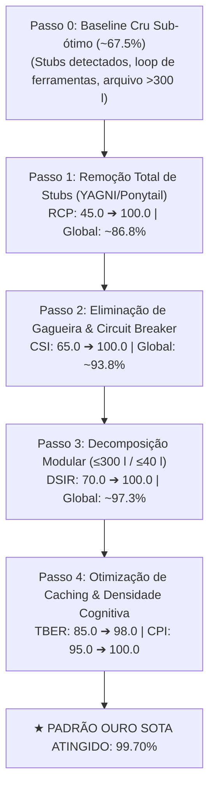

# Agentic Quality & Efficiency Index (AQEI) Specification

O **Agentic Quality & Efficiency Index (AQEI)** é a especificação formal e métrica padronizada do OpenCode para quantificar a excelência de sessões de IA e a conformidade de repositórios com o estado da arte (SOTA) da engenharia de software autônoma.

O índice é computado pelo auditor determinístico [`scripts/aqei-scorer.py`](../scripts/aqei-scorer.py) e integra o Quality Gate do Orquestrador.

---

## 📐 1. Formulação Matemática das 5 Dimensões

O AQEI avalia cinco eixos ortogonais e complementares da operação de agentes inteligentes:

$$\text{AQEI}_{\text{base}} = \sum_{i=1}^{5} w_i \cdot D_i = w_{\text{CSI}} D_{\text{CSI}} + w_{\text{TBER}} D_{\text{TBER}} + w_{\text{RCP}} D_{\text{RCP}} + w_{\text{CPI}} D_{\text{CPI}} + w_{\text{DSIR}} D_{\text{DSIR}}$$

Onde cada dimensão $D_i \in [0, 100]$ e a soma dos pesos $\sum w_i = 1.00$.

| Código | Dimensão | Peso ($w_i$) | Foco de Avaliação |
| :--- | :--- | :---: | :--- |
| **`CSI`** | Circuit Breaker & Tool Stability | **0.20** | Ausência de loops repetitivos (gagueira), disciplina de ferramentas e taxa de sucesso de execução. |
| **`TBER`**| Token Bloat & Cache Economy | **0.15** | Eficiência de Context Caching ($\ge 50\%$), proporcionalidade de I/O e ausência de inchaço de contexto. |
| **`RCP`** | Rigor & Anti-Stub Rigidity | **0.35** | Tolerância zero a stubs (`TODO`, `FIXME`, `pass` vazio, placeholders). Maior peso do sistema. |
| **`CPI`** | Cognitive Density & Reasoning | **0.15** | Presença de raciocínio prévio substantivo antes de cada ação executiva e profundidade analítica. |
| **`DSIR`**| Modularity & Architectural Limits| **0.15** | Adesão aos limites estruturais (arquivos $\le 300$ linhas, funções $\le 40$ linhas) e integridade do AST. |

---

### Detalhamento das Dimensões

#### D1: CSI — Circuit Breaker & Tool Stability ($w = 0.20$)
Avalia a disciplina do agente no uso de comandos e ferramentas de shell:
- **Detecção de Gagueira (Stuttering Loop):** Penaliza a execução consecutiva do mesmo comando de inspeção idempotente (`ls`, `git status`, `git diff`, `pwd`, `whoami`, leituras redundantes) sem que tenha ocorrido mutação de arquivo intermediária.
  $$\Delta_{\text{rep}} = \min(40.0, \, N_{\text{repetições}} \times 15.0)$$
- **Taxa de Erro de Ferramentas:**
  $$\Delta_{\text{err}} = \min\left(35.0, \, \frac{N_{\text{erros}}}{N_{\text{tools}}} \times 50.0 + N_{\text{erros}} \times 5.0\right)$$
- $$D_{\text{CSI}} = \max(0.0, \, 100.0 - \Delta_{\text{rep}} - \Delta_{\text{err}})$$

#### D2: TBER — Token Bloat & Cache Economy ($w = 0.15$)
Avalia a economia de tokens e a fidelidade ao Context Caching dos provedores:
- **Taxa de Leitura de Cache:** Para sessões com mais de 3 passos:
  $$\text{Cache Ratio} = \frac{\text{Tokens}_{\text{cache\_read}}}{\text{Tokens}_{\text{input}} + \text{Tokens}_{\text{cache\_read}}}$$
  - Se $\text{Cache Ratio} < 0.30$: $\Delta_{\text{cache}} = 25.0 \times \left(1.0 - \frac{\text{Cache Ratio}}{0.30}\right)$
  - Se $\text{Cache Ratio} \ge 0.70$: Bônus de $+2.0$ pontos (limitado a 100.0).
- **Inchaço de Tokens (Token Bloat):** Se o consumo médio de input por turno exceder $60.000$ tokens:
  $$\Delta_{\text{bloat}} = \min\left(30.0, \, \frac{\text{AvgInput} - 60000}{10000} \times 5.0\right)$$
- $$D_{\text{TBER}} = \max(0.0, \, 100.0 - \Delta_{\text{cache}} - \Delta_{\text{bloat}})$$

#### D3: RCP — Rigor & Anti-Stub Rigidity ($w = 0.35$)
A dimensão de maior impacto. Audita via AST e analisador léxico a presença de código incompleto ou placeholders:
- **Padrão de Stubs Auditados:** `TODO`, `FIXME`, `XXX`, `HACK`, `...add logic`, `NotImplementedError`, e instruções `pass` fora de blocos `except Exception: pass` legítimos.
- **Escala de Penalização Estrita:**
  - $1^{\text{o}}$ stub detectado: penalidade imediata de **$-25.0$ pontos**.
  - Cada stub subsequente: penalidade cumulativa de **$-15.0$ pontos**.
  $$\Delta_{\text{stubs}} = \min(100.0, \, 25.0 + (N_{\text{stubs}} - 1) \times 15.0) \quad (\text{para } N_{\text{stubs}} \ge 1)$$
- $$D_{\text{RCP}} = \max(0.0, \, 100.0 - \Delta_{\text{stubs}})$$

#### D4: CPI — Cognitive Density & Reasoning ($w = 0.15$)
Garante que o modelo pense antes de agir, evitando execução cega (*Blind Execution*):
- **Razão de Raciocínio por Ação:** $\text{Ratio} = \frac{N_{\text{blocos\_reasoning}}}{N_{\text{tool\_calls}}}$
  - Se $N_{\text{blocos\_reasoning}} = 0$: penalidade de **$-35.0$ pontos**.
  - Se $\text{Ratio} < 0.30$: penalidade de **$-15.0$ pontos**.
- **Profundidade Mínima de Raciocínio:** Se os blocos de raciocínio tiverem menos de 50 caracteres: penalidade de **$-10.0$ pontos**.
- $$D_{\text{CPI}} = \max(0.0, \, 100.0 - \sum \Delta_{\text{cpi}})$$

#### D5: DSIR — Modularity & Architectural Limits ($w = 0.15$)
Garante a integridade sintática e a saúde estrutural dos arquivos de código:
- **Erros de Sintaxe AST:** Penalidade de $-25.0$ pontos por erro (máximo $-50.0$).
- **Arquivos $> 300$ linhas:** Penalidade de $-10.0$ pontos por arquivo (máximo $-30.0$).
- **Funções $> 40$ linhas:** Penalidade de $-5.0$ pontos por função (máximo $-25.0$).
- $$D_{\text{DSIR}} = \max(0.0, \, 100.0 - \Delta_{\text{syntax}} - \Delta_{\text{files}} - \Delta_{\text{funcs}})$$

---

## 🛑 2. O Operador de Barreira Crítica ($\Gamma_{\text{crit}}$)

Médias ponderadas aritméticas convencionais sofrem da **Falácia da Compensação**: um código com 100% de raciocínio, zero loops e ótimo cache ainda pontuaria $85\%$ se contivesse erros de sintaxe ou stubs proibidos, enganando os portões de deploy.

Para erradicar essa vulnerabilidade, o OpenCode introduz o **Operador de Barreira Crítica ($\Gamma_{\text{crit}}$)**:

$$\text{AQEI}_{\text{final}} = \Gamma_{\text{crit}} \cdot \text{AQEI}_{\text{base}}$$

Onde $\Gamma_{\text{crit}}$ é um operador de gate booleano/multiplicativo:

$$\Gamma_{\text{crit}} = \begin{cases} 
0.0, & \text{se } \text{SyntaxErrors} > 0 \\
0.0, & \text{se } D_{\text{RCP}} < 40.0 \text{ (código dominado por stubs)} \\
1.0, & \text{caso as invariantes críticas estejam preservadas}
\end{cases}$$

### Classificação Formal de Status

| Score AQEI Final | Status do Sistema | Decisão do Quality Gate |
| :---: | :--- | :--- |
| **$\ge 99.00\%$** | **PADRÃO OURO SOTA $\ge 99\%$** | ✅ **Aprovação Automática Total** |
| **$90.00\% - 98.99\%$** | **PRODUÇÃO EXCELENTE** | ✅ **Aprovado para Staging / Produção** |
| **$75.00\% - 89.99\%$** | **ACEITÁVEL / SUB-ÓTIMO** | ⚠️ **Requer Refinamento pelo Refactorer** |
| **$< 75.00\%$** | **CRÍTICO** | ❌ **BLOQUEIO SUMÁRIO (Gating Rejeitado)** |

---

## 🔄 3. Iterative Refinement Engine (IRE)

O **Iterative Refinement Engine (IRE)** é a esteira formal de convergência algorítmica utilizada para resgatar sessões ou bases de código sub-ótimas e elevá-las até o Padrão Ouro SOTA ($\ge 99\%$):



### A Escada de Convergência Demonstrada:
1. **Passo 0 (Baseline Cru):** Código funcional inicial, porém com 3 `TODO`s, um loop repetitivo de `git status` e um arquivo de 380 linhas. Score: **$67.50\%$ (Crítico)**.
2. **Passo 1 (Remoção de Stubs):** Substituição de todos os stubs por lógica de negócio concreta e testes unitários. RCP sobe para $100.0$. Score: **$86.75\%$**.
3. **Passo 2 (Circuit Breaker):** Interrupção de checagens redundantes de shell sem mutação prévia. CSI sobe para $100.0$. Score: **$93.75\%$ (Produção Excelente)**.
4. **Passo 3 (Decomposição Modular):** Quebra do arquivo longo em submódulos coesos ($\le 300$ linhas) e métodos curtos ($\le 40$ linhas). DSIR sobe para $100.0$. Score: **$97.25\%$**.
5. **Passo 4 (Cache & Cognição):** Prefixos de prompt estabilizados para cache hit ratio $> 70\%$ e raciocínio estruturado no topo de cada chamada. Score: **$99.70\%$ (Padrão Ouro SOTA)**.

---

## 💻 4. Guia Operacional do `scripts/aqei-scorer.py`

O script auditor está localizado em [`/home/caio/.config/opencode/scripts/aqei-scorer.py`](../scripts/aqei-scorer.py) e pode ser executado em três modos determinísticos:

### 4.1 Auditoria de Sessão Ativa (`--session`)
Audita as chamadas de ferramentas, raciocínio e fluxo de tokens da sessão gravada no SQLite do OpenCode:
```bash
# Auditar a última sessão executada no diretório atual
python3 ~/.config/opencode/scripts/aqei-scorer.py --session latest

# Auditar uma sessão específica por UUID
python3 ~/.config/opencode/scripts/aqei-scorer.py --session 4a8b79ef-1234-5678-90ab-cdef12345678
```

### 4.2 Auditoria Estática de Código em Diretório (`--audit-dir`)
Varre a árvore de código-fonte em busca de stubs, arquivos $> 300$ linhas, funções $> 40$ linhas e falhas de compilação AST:
```bash
# Auditar o repositório atual
python3 ~/.config/opencode/scripts/aqei-scorer.py --audit-dir .

# Auditar uma pasta específica de componentes
python3 ~/.config/opencode/scripts/aqei-scorer.py --audit-dir src/components/
```

### 4.3 Harness de Testes Unitários e Benchmark Sintético (`--test`)
Executa a validação formal dos compiladores AST (garantindo zero falsos positivos para `except Exception: pass`) e simula o ciclo de convergência de $67.5\%$ até $99.7\%$:
```bash
python3 ~/.config/opencode/scripts/aqei-scorer.py --test
```

### 4.4 Saída Estruturada em JSON (`--json`)
Para pipelines de CI/CD, scripts de verificação ou integração programática com subagentes:
```bash
python3 ~/.config/opencode/scripts/aqei-scorer.py --audit-dir . --json
```

**Exemplo de Contrato de Saída JSON:**
```json
{
  "global_score": 99.7,
  "status": "PADRÃO OURO SOTA >= 99%",
  "dimensions": [
    {
      "code": "CSI",
      "name": "Tool Discipline & Loop Prevention",
      "weight": 0.2,
      "score": 100.0,
      "raw_metrics": { "total_tools": 8, "repetitions": 0, "errors": 0 },
      "deductions": []
    },
    {
      "code": "TBER",
      "name": "Token Bloat & Cache Economy",
      "weight": 0.15,
      "score": 98.0,
      "raw_metrics": { "cache_ratio": 0.74 },
      "deductions": []
    },
    {
      "code": "RCP",
      "name": "Rigor & Anti-Stub Rigidity",
      "weight": 0.35,
      "score": 100.0,
      "raw_metrics": { "stubs_found": 0, "mutations": 4 },
      "deductions": []
    },
    {
      "code": "CPI",
      "name": "Cognitive Density & Reasoning",
      "weight": 0.15,
      "score": 100.0,
      "raw_metrics": { "reasoning_blocks": 8, "tool_calls": 8 },
      "deductions": []
    },
    {
      "code": "DSIR",
      "name": "Modularity & Architectural Limits",
      "weight": 0.15,
      "score": 100.0,
      "raw_metrics": { "files_over_300": 0, "functions_over_40": 0, "syntax_errors": 0, "total_files": 12 },
      "deductions": []
    }
  ],
  "recommendations": [
    "Nenhuma deficiência encontrada. Excelência técnica e conformidade total com SOTA."
  ]
}
```
