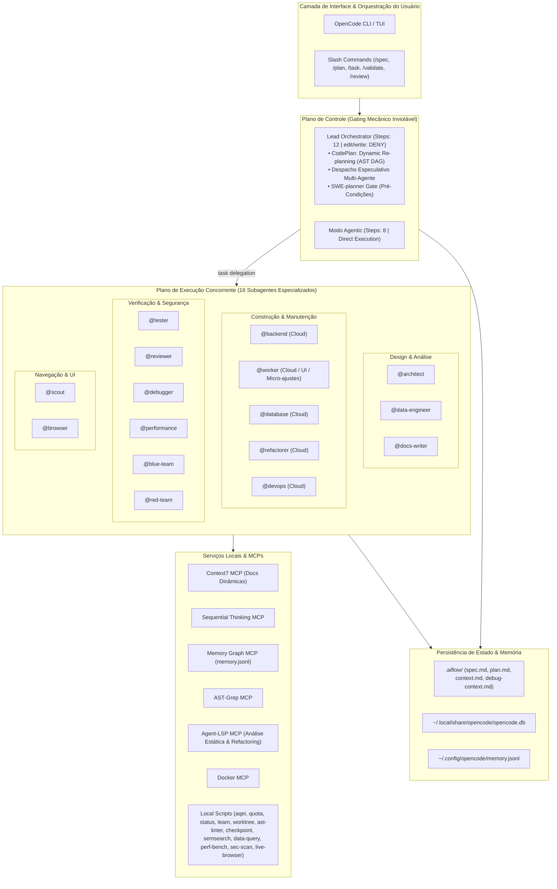

# OpenCode Living Architecture & Documentation Portal

Bem-vindo ao portal central de documentação técnica viva da plataforma **OpenCode**. Este repositório de documentos é mantido continuamente pelo subagente `docs-writer` e serve como referência canônica de engenharia para operadores humanos e agentes autônomos.

---

## 🗺️ 1. Mapa de Navegação da Documentação

A documentação é organizada em quatro pilares fundamentais, cobrindo desde a filosofia ontológica até a especificação atômica de ferramentas:

| Documento | Foco Primário | Público-Alvo & Gatilho de Consulta |
| :--- | :--- | :--- |
| [**`ARCHITECTURE.md`**](./ARCHITECTURE.md) | **Ontologia do Sistema e Princípios Governantes**<br>Separação Control/Data Plane, PoLA, Governança Bimodal (`orchestrator` vs `agentic`), protocolos de ponta (CodePlan, Despacho Especulativo, SWE-planner Gate), limites modulares (<=300/<=40 linhas), resiliência de rede e restrições de payload. | Obrigatório para o `orchestrator`, `architect` e novos agentes compreendendo a topologia e garantias do runtime. |
| [**`AGENTS_REGISTRY.md`**](./AGENTS_REGISTRY.md) | **Catálogo Vivo de Agentes (16 Subagentes + 4 Primários)**<br>Identidade, contratos estritos de entrada (I/O), ferramentas autorizadas, Definition of Done (DoD) e matriz de anti-patterns de cada papel. | Consulta mandatória antes de despachar chamadas `task` concorrentes ou assumir papéis especializados. |
| [**`METRICS_AQEI.md`**](./METRICS_AQEI.md) | **Agentic Quality & Efficiency Index (AQEI)**<br>Formulação matemática das 5 dimensões (CSI, TBER, RCP, CPI, DSIR), operador de barreira crítica $\Gamma_{\text{crit}}$ e motor de refinamento iterativo (IRE) até $\ge 99\%$ SOTA. | Utilizado por `reviewer`, `tester` e no quality gate para auditoria objetiva de sessões e repositórios. |
| [**`TOOLING_CATALOG.md`**](./TOOLING_CATALOG.md) | **Catálogo de Utilitários In-Process (`scripts/`) & Servidores MCP**<br>Especificação de `aqei-scorer.py`, `quota.py`, `status.py`, `learn.py`, `worktree-runner.sh`, `ast-linter-hook.py`, `checkpoint.py`, `semantic-code-search.py`, `data-query.py`, `perf-bench.py`, `sec-scan.py`, `live-browser.js` e do servidor MCP ativo `agent-lsp`, com flags CLI e esquemas JSON. | Guia de execução rápida para comandos de terminal, auditorias de segurança, benchmarks e análise de dados. |

---

## 🏛️ 2. Topologia Geral do Sistema

O OpenCode opera como uma arquitetura distribuída de microssistemas cognitivos executados localmente, estruturada em cinco camadas desacopladas:



### Distribuição dos 16 Subagentes Especializados

| Cluster | Subagente | Runtime / Modelo | Permissão | Ferramentas & Scripts Mandatórios | Atribuição Principal |
| :--- | :--- | :--- | :--- | :--- | :--- |
| **Construção** | `@worker` | Cloud (`claude-sonnet-5-5`) | Total | `write`, `edit`, `read`, MCP `context7`, MCP `ast-grep` | Micro-ajustes/CSS (Faixa A), UI anti-AI-slop, estado complexo, contexto médio/longo |
| **Construção** | `@backend` | Cloud (`claude-sonnet-5-5`) | Total | `write`, `edit`, MCP `context7`, MCP `ast-grep`, MCP `agent-lsp`, `bash` | POO, DDD, Clean Architecture, APIs e microsserviços |
| **Construção** | `@database` | Cloud (`claude-sonnet-5-5`) | Total | `write`, `edit`, `read`, `bash` | Modelagem relacional 3NF, Expand-and-Contract, índices |
| **Construção** | `@refactorer` | Cloud (`claude-sonnet-5-5`) | Total | `edit`, `write`, MCP `ast-grep`, MCP `agent-lsp`, `ast-linter-hook.py` | Refatoração Fowler, limites 40/300L, testes verdes |
| **Construção** | `@devops` | Cloud (`claude-sonnet-5-5`) | Total | `write`, `edit`, MCP `docker`, `bash` | Docker multi-stage, Compose, CI/CD sem root |
| **Design/Análise** | `@architect` | Cloud (`claude-opus-5-5`) | Leitura | `read`, `glob`, `grep`, MCP `sequentialthinking` | Contratos de interface, diagramas Mermaid, ADRs |
| **Design/Análise** | `@data-engineer` | Cloud (`claude-sonnet-5-5`) | Total | `write`, `edit`, script `data-query.py`, Polars | Pipelines ETL/ELT idempotentes, conversão Parquet |
| **Design/Análise** | `@docs-writer` | Cloud (`claude-sonnet-5-5`) | Total | `write`, `edit`, `read`, `glob` | Documentação técnica viva adaptada ao guia de estilo |
| **Qualidade/Audit** | `@tester` | Cloud (`claude-sonnet-5-5`) | Total | `write`, `edit`, script `live-browser.js`, `bash` | TDD adversarial, testes unitários, E2E Playwright |
| **Qualidade/Audit** | `@reviewer` | Cloud (`claude-sonnet-5-5`) | Leitura | `read`, `git diff`, `aqei-scorer.py`, `ast-linter-hook.py` | Quality Gate semafórico, auditoria AQEI $\ge 99\%$ |
| **Qualidade/Audit** | `@debugger` | Cloud (`claude-opus-5-5`) | Leitura | `read`, MCP `ast-grep`, `bash` | Eliminação empírica de hipóteses, causa-raiz isolada |
| **Qualidade/Audit** | `@performance` | Cloud (`claude-sonnet-5-5`) | Total | script `perf-bench.py` (Hyperfine, Autocannon) | Profiling de latência de cauda (p95/p99) e carga USE |
| **Segurança** | `@blue-team` | Cloud (`claude-sonnet-5-5`) | Total | script `sec-scan.py` (Semgrep, Gitleaks, OSV) | AppSec defensivo, SAST, CVEs, OWASP ASVS |
| **Segurança** | `@red-team` | Cloud (`claude-sonnet-5-5`) | Leitura | `bash` (`curl`, scripts locais), `read` | Modelagem STRIDE, sondagem não-destrutiva de rotas |
| **Navegação/UI** | `@scout` | Cloud (`claude-sonnet-5-5`) | Leitura | `graphify`, MCP `ast-grep`, MCP `agent-lsp`, `grep`, `find`, `ls` | Mapeamento estrutural de codebase sem inchaço |
| **Navegação/UI** | `@browser` | Cloud (`claude-sonnet-5-5`) | Total | `playwright-cli`, Chromium, script `live-browser.js` | Automação CLI atômica, inspeção DOM/CDP em navegador |

---

## ⚡ 3. Protocolo de Consulta Pré-Voo para Agentes

Antes de iniciar qualquer ciclo de trabalho ou mutação de código, todo agente autônomo deve seguir este checklist determinístico:

```
[Passo 1: Leitura de Contexto Dinâmico]
   └── Se existir `.aiflow/context.md` no repositório atual, leia-o imediatamente para
       capturar padrões emergentes, anti-padrões e comportamentos não-óbvios de libs.

[Passo 2: Reconhecimento de Modo Operacional]
   ├── Se em modo `orchestrator`:
   │     • Inspecione `ARCHITECTURE.md` (Seção 2: Governança Bimodal).
   │     • Inicialize o `todowrite` para estruturar a esteira de 5 milestones.
   │     • Proibido executar mutações (`edit`/`write`) diretamente.
   └── Se em modo `agentic`:
         • Aplique a escada YAGNI (Locate -> Edit -> Finish) com retorno conciso.

[Passo 3: Inspeção de Estilo de Documentação (Docs-Writer)]
   └── Verifique a cadeia de precedência:
         1. `.aiflow/docs-style.md` (específico do projeto).
         2. `docs/style.md` (se adotado no repositório).
         3. `~/.config/opencode/docs-style.md` (guia global).

[Passo 4: Verificação de Limites Arquiteturais (Anti-Regression)]
   └── Certifique-se de que qualquer código produzido respeite rigorosamente:
         • Arquivos <= 300 linhas de código.
         • Funções/métodos <= 40 linhas de código.
         • Zero stubs (proibido `// TODO`, `pass` como placeholder, ou stubs temporários).
```

---

## 📋 4. Matriz de Comandos da Plataforma OpenCode

O sistema implementa uma esteira formal orientada a especificações (*Spec-Driven Development*) controlada via slash commands:

| Comando | Agente Responsável | Propósito & Saída Esperada |
| :--- | :--- | :--- |
| `/init` | `build` | Inicializa a exclusão de `.aiflow/` em `.git/info/exclude`, gera `AGENTS.md` adaptado à stack e cria `docs/decisions/`. |
| `/spec` | `build` | Detecta branch, compara com spec anterior (ou arquiva em `.aiflow/archive/`), lê ADRs e classifica a complexidade (`TRIVIAL`, `SIMPLES`, `COMPLEXA`). |
| `/plan` | `build` | Cria `.aiflow/plan.md` aplicando o **SWE-planner Gate** (verificação física de arquivos e símbolos via `ast-grep`/`read`) com cabeçalho de estado (`# Classificação`, `# Branch`, `# Base`) e lista de tarefas ordenadas por dependência. |
| `/task` | `worker` / `plan` | Executa a próxima tarefa `[ ]` pendente ou uma tarefa ad-hoc. Cria `.aiflow/task-test.sh`, implementa o código e valida em TDD. Em bloqueios, consulta o `@debugger` para localização hierárquica de falhas. |
| `/tasks` | `orchestrator` | Executa em lote tarefas pendentes com **Dynamic Re-planning (CodePlan)** via diffs de AST, stop-on-error gate e limpeza atômica de testes aprovados. |
| `/validate` | `tester` | Portão completo de qualidade: suíte de testes, linter, type-check, auditoria de dependências e cobertura. Gera `.aiflow/debug-context.md` em falhas. |
| `/review` | `reviewer` | Auditoria completa do diff contra critérios de aceitação do spec e conformidade com ADRs em `docs/decisions/`. Emite relatório semafórico (🔴/🟡/🟢). |
| `/commit` | `agentic` | Executa checklist de segurança, valida que testes passam e commita na branch de trabalho com mensagem resumida em Conventional Commits em português. |
| `/mr` | `agentic` | Cria branch de feature/fix, efetua push com upstream e exibe template formatado no terminal para abertura do Pull/Merge Request. |
| `/debug` | `debugger` | Diagnóstico automático a partir de `.aiflow/task-test.log` ou `.aiflow/debug-context.md`, consultando o `@debugger` como **Oráculo de Localização Hierárquica de Falhas** (Agentless Protocol) para emitir o `Fault Localization DTO` antes da mutação. |
| `/refactor` | `refactorer` | Refatoração atômica orientada a SOLID e limites de 40/300 linhas com snapshot de testes verdes preservado. |
| `/adr` | `architect` | Registra novo Architecture Decision Record em `docs/decisions/ADR-[DATA]-[TITULO].md`. |
| `/map` & `/analyze`| `build` (`/map`) / `plan` (`/analyze`) | Mapeamento estrutural sem leitura (`/map`) e análise cirúrgica focada (`/analyze`) sem estourar a janela de contexto. |
| `/audit` | `blue-team` | Scanner de segurança unificado: `sec-scan all`, segredos (Gitleaks), SAST (Semgrep) ou CVEs (OSV-Scanner). |
| `/perf` | `performance` | Benchmark estatístico CLI via Hyperfine (`perf-bench cli`) ou teste de carga HTTP via Autocannon (`perf-bench http`). |
| `/data` | `data-engineer` | Execução analítica in-process SQL sobre arquivos locais via DuckDB (`data-query`). |
| `/quota` | CLI direta | Exibição determinística instantânea dos limites e cotas dos modelos ativos via `scripts/quota.py`. |
| `/status` | CLI direta | Painel unificado de status (Cotas + AQEI + Git) via `scripts/status.py`. |
| `/semsearch` | CLI direta | Busca semântica vetorial por intenção na GPU local (Ollama / nomic-embed-text) via `scripts/semantic-code-search.py`. |
| `/learn` | CLI direta | Extrator de aprendizados e sincronizador com Memory MCP (`memory.jsonl`) via `scripts/learn.py`. |
| `/sandbox` | CLI direta | Executa tarefas em sandbox efêmero via Git Worktree (Two-Phase Commit) via `scripts/worktree-runner.sh`. |
| `/checkpoint` | CLI direta | Snapshot de estado e monitor de higiene de sessão (teto de 40 turnos) via `scripts/checkpoint.py`. |

---

## 🔒 5. Princípios de Governança e Integridade

1. **Determinismo sobre Especulação:** Agentes nunca adivinham métricas, latências ou comportamentos de biblioteca. Consultam empiricamente scripts ou ferramentas dedicadas (`data-query`, `perf-bench`, `context7`).
2. **Anti-AI-Slop Visual e Arquitetural:** Interfaces gráficas seguem padrões editoriais refinados (double-bezel, macro-espaçamento, paleta contida), rejeitando componentes genéricos de IA. Códigos rejeitam over-engineering e wrappers desnecessários (Ponytail/YAGNI).
3. **Persistência de Aprendizado:** Cada bug resolvido e comportamento não-óbviano descoberto é obrigatoriamente persistido em `.aiflow/context.md` e na memória vetorial/grafos para imunizar a equipe contra regressões futuras.
